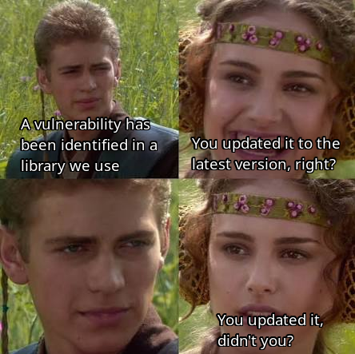

# Update. Your. Dependencies.

First of all, apologies for the passive-aggressive title. Engagement, wow effect, you know.

A well-known threat model is the following:

1. You're using software with a vulnerability. No one knows that vulnerability exists.
2. The vulnerability is discovered. Maintainers of said software are notified and fix it.
3. The fix is issued. At that moment, the vulnerability becomes public. At this moment, you are
    vulnerable.
4. ...

These days, it is well-known that keeping yourself up-to-date with security patches is not optional
for security. Software providers have gone through great lengths to give us updates without even
asking for permission (think Windows Update, Google Play, etc.). Some people dislike this (perhaps
out of distrust to big software vendors, which I can understand), but it is undeniable that
seamless, no-effort automatic updates are a fantastic cybersecurity measure. If updating creates
friction for the user, it is more likely that they will not do it, increasing the likelihood of an
attack.

However, I would not like to focus on bringing security to end users. I want to focus on securing
the software we create and ship. In the meme above, Padmé asks Anakin whether he updated the
vulnerable dependency. One factor which we mentioned before is easily identifiable here: friction.
It is implied that Anakin has already done the job of staying up to date on vulnerabilities, but
now he has to do more work: he has to update the dependency, verify the new version works, raise a
pull request and deploy the new, non-vulnerable version. This friction is a developer experience
problem, i.e. a DevOps problem. So how do we solve it?

## Dependency bots

First things first, we should automate repetitive work. Checking all of your dependencies
(including lock files) is something people won't ever do manually. Thankfully, **Dependabot** and
**Renovate Bot** exist, the former being Github-only with the latter being platform agnostic. These
tools will check your package.jsons, your pyproject.tomls, your whatever.locks, etc. and they will
do the tedious effort of going to the source and checking the latest version. They'll even create
pull requests for you if an update is due.

## CI/CD

Obviously, you have very strong CI/CD, with extensive test coverage and automatic deployments on
test environments, which get triggered automatically on every pull request. Thanks to this, you can
be sure that these dependency updates will not break your software when you deploy them. You don't
even need to trust that minor version update shouldn't have been a major update as it breaks APIs!

## See what you did?

You just added one simple tool, a dependency bot (obviously, you already had very strong CI/CD for
its many advantages, so you didn't need to do anything there). Now all you need to do is your daily
routine of clicking "Merge" on a few PRs and you'll be updated. You don't even care whether the
updates are actually important.

What we have done so far is, in my opinion, a bare-minimum requirement. Despite apologizing for the
aggressive title I chose for this entry, I very strongly believe we should all be doing this. It's
just a good practice, which creates little friction and doesn't take very long to set up. You can
go further: dashboards, vulnerability management tool, a simple subscription to CISA...depending
on the criticality and exposure of your software, you might consider those. But a dependency bot?
I encourage you to consider it irrespective of the type of software you're running.

## But how do I do this?

It will depend on the platform where you're hosting your code, but it is quite simple to set up a
self-hosted Renovate bot runner for your personal projects. You can check out my
[self-hosted Renovate bot runner on Github](https://github.com/Joan-ML/renovate-bot).
At enterprise scale, it will obviously depend on the platform you're on, the amount of repos you
have, etc.

The real challenge isn't setting up the tool (any experienced DevOps engineer will
figure it out sooner or later); the real challenge is getting everyone on board. Some teams might
find this very useful, while others might not care, or think it's a "not-me" problem and try to
offload it to someone else. While I have always had very good experiences getting teams to like
this tool, this may not always be the case. In my experience, cultural/political conflicts are much
more difficult to tackle, and while part of our job as DevOps engineers is to manage the social
aspect of software development, we don't always have the authority to back us up, and not everyone
is equally open to innovation. Sadly, I hope you weren't looking for answers on that here.

*27-09-2026*